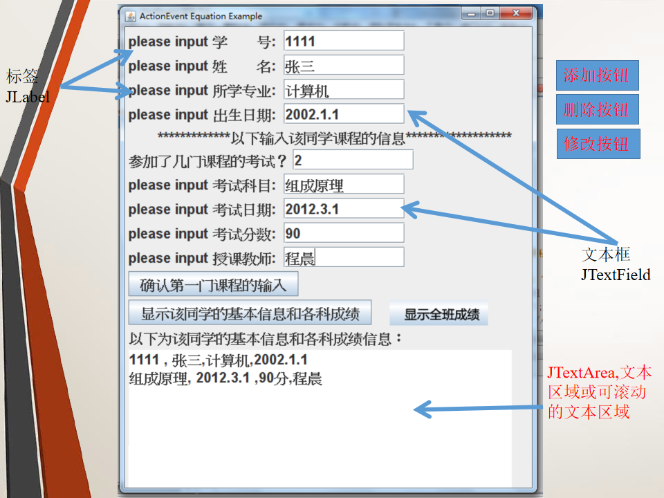

# GUI成绩单管理系统

#### 题目描述
《成绩单管理系统》的输入和输出换成在GUI图形用户界面实现。参看下一页的界面，但不限于下页界面形式布局。可参考第9章PPT最后几页的一元二次方程的GUI程序，里面有关于按钮的事件处理。有详细的解释说明！！！

#### 可选
用实用类、集合，如向量，列表实现成绩单的管理（ArrayList），在界面中添加一个“班级打印按钮”，打印输出某个班级全部同学的成绩单。

### 售货机双盲测试报告要求

#### 正确性验证
编写测试用例，用于测试功能要求能否全面满足。

编写测试用例，用于测试输入是否正确（友好）。

#### 测试BUG
测出至少5个以上Bug。如：超范围输入是否有提示等。

#### 写出测试总结
测试用例和测试结果要一一对应，要能再现错误。

总结每个bug，bug出现的位置，导致的效果截图。

给分依据。
